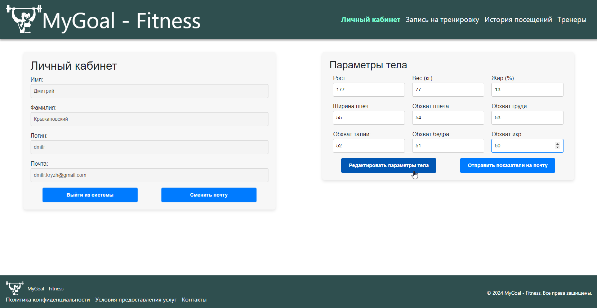
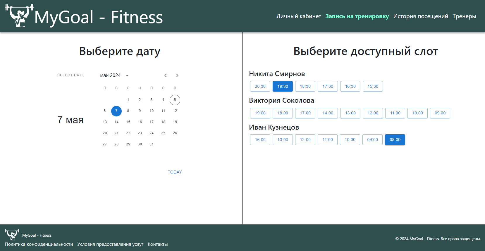
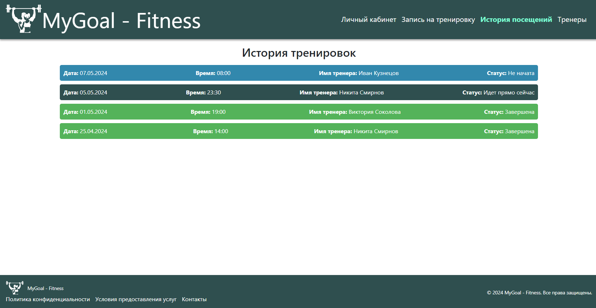

# "MyGoal" Fitness Center

Welcome to the MyGoal Fitness Center web application! This project provides a platform for users to manage their fitness journey, including tracking body parameters, scheduling sessions with trainers, and viewing workout history.

## Features

- **Profile Page**: Update your body parameters and send the updated information to your specified email address.

  

- **Calendar Page**: Choose a date, time, and trainer for your workout sessions.

  

- **Workout History Page**: View the history of your training sessions.

  

- **Trainers Page**: Browse the list of available trainers.

  

## Technology Stack

- **Backend**: Java Spring
- **Frontend**: React
- **Database**: PostgreSQL
- **Reverse Proxy**: Nginx
- **Database Management**: pgAdmin

## Getting Started

These instructions will help you set up and run the project on your local machine for development and testing purposes.

### Prerequisites

Make sure you have Docker and Docker Compose installed on your system.

### Installation

1. Clone the repository:

    ```sh
    git clone https://github.com/yourusername/mygoal-fitness-center.git
    cd mygoal-fitness-center
    ```

2. Create a `.env` file in the root directory of the project and add the following environment variables:

    ```env
    POSTGRES_PASSWORD=your_postgres_password
    PGADMIN_DEFAULT_EMAIL=your_pgadmin_email
    PGADMIN_DEFAULT_PASSWORD=your_pgadmin_password
    ```

### Running the Application

1. Build and start the Docker containers:

    ```sh
    docker-compose up -d --build
    ```

2. Access the application:
    - Frontend: [http://localhost:3000](http://localhost:3000)
    - Backend: [http://localhost:8080](http://localhost:8080)
    - pgAdmin: [http://localhost:5050](http://localhost:5050) (Use the email and password from your `.env` file)
    - Nginx (Reverse Proxy): [http://localhost](http://localhost)

### Stopping the Application

To stop the running containers, use:

```sh
docker-compose down
